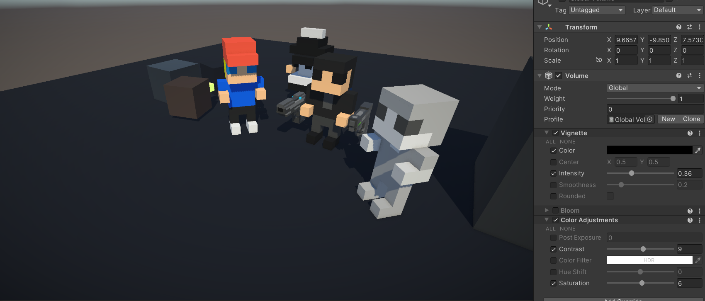

# 开发者日志00

时间：2024年2月-2024年3月

## 兴趣使然的项目

## Unity Version Control

我们使用了Unity推荐的官方的版本管理系统。Unity自带的版本管理在一定程度上是十分令人迷惑的，Plastic SCM Cloud和Unity Cloud，目前的实际情况是，他们是同一个东西。

还需要注意的是，Unity的中国版本和海外版本自带的版本控制不互通，Unity中国有15GB的免费云端储存，海外版只有5GB，往上需要付费。我们目前使用的Unity海外版，版本管理是免费的5GB。

与此同时，Unity有一个中国特供的**团结引擎**，似乎提供更多更好的特性，后续值得专门研究一下。

## Unity URP Settings

Unity URP渲染管线文档：[Universal Render Pipeline Asset](https://docs.unity3d.com/Packages/com.unity.render-pipelines.universal@14.0/manual/universalrp-asset.html)

目前的Unity项目后处理效果对比：

## Unity Collider & RigidBody

1. [Rigidbody in Unity - Everything You Need to Know](https://www.youtube.com/watch?v=Y3xkgpCukow)

    总结：

    - RigidBody是赋予GameObject物理属性的Component（继承自Component class，与MonoBehavior相 同）。其背后的物理引擎是Nvidia Physix和Box2D
    - **重要：选择Kinematic后，物体就不会参与物理的模拟**。
    - 选择Interpolate选项可以在一定程度上帮助物体运动更流畅。
    - 对于碰撞检测，默认的Discrete选择性能最好，但在物体速度过快时（例如子弹）可能会出现碰撞没有被  检测到的情况。具体使用那种模式，可以参考文档[Rigidbody.collisionDetectionMode](https://docs.unity.cn/cn/2022.3/ScriptReference/Rigidbody-collisionDetectionMode.html)。对于目前   这个项目来说，尽量使用Discrete模式。
    - 利用Constraints来限制物体的移动。
    - 同时，涉及到物理模拟的代码在`FixUpdate()`中更新，保证一致性。类似的，尽量不要弄混对于Transfrom位置的直接操作和物理操作（例如施加力）。

2. [From Beginner to Pro: Mastering Unity's Colliders](https://www.youtube.com/watch?v=qcGa_mzjc8Q)

    总结：

    - 没有RigidBody的Collider被分为Static Collider，有的则被分为Dynamic Collider。
    - 可以使用Tag和Layer来设置分类碰撞检测，需要更复杂的情况可以使用Physics->Layer Collision Matrix设置。
    - 详细文档参考[Introduction to collision](https://docs.unity3d.com/2022.3/Documentation/Manual/CollidersOverview.html)。

## 注意事项

- **实现层永不否定设计层**，有的时候我过于被作为软件开发的常规思路限制了。游戏需要创意，不能因为技术上不好做就放弃一个可能非常有趣的设计。
- Unity老版本项目打开过程中的注意事项：Unity->Window->Package Manger->Visual Studio, Unity UI, etc。报错可能来自没有安装的Package。

## Unity Netcode

需要的package有Netcode for GameObjects和Multiplayer tools。

其中Network Manager以Singleton的形式存在，需要添加到Scene当中。之后选择适合的Transport，对于我们项目是Unity Transport。
