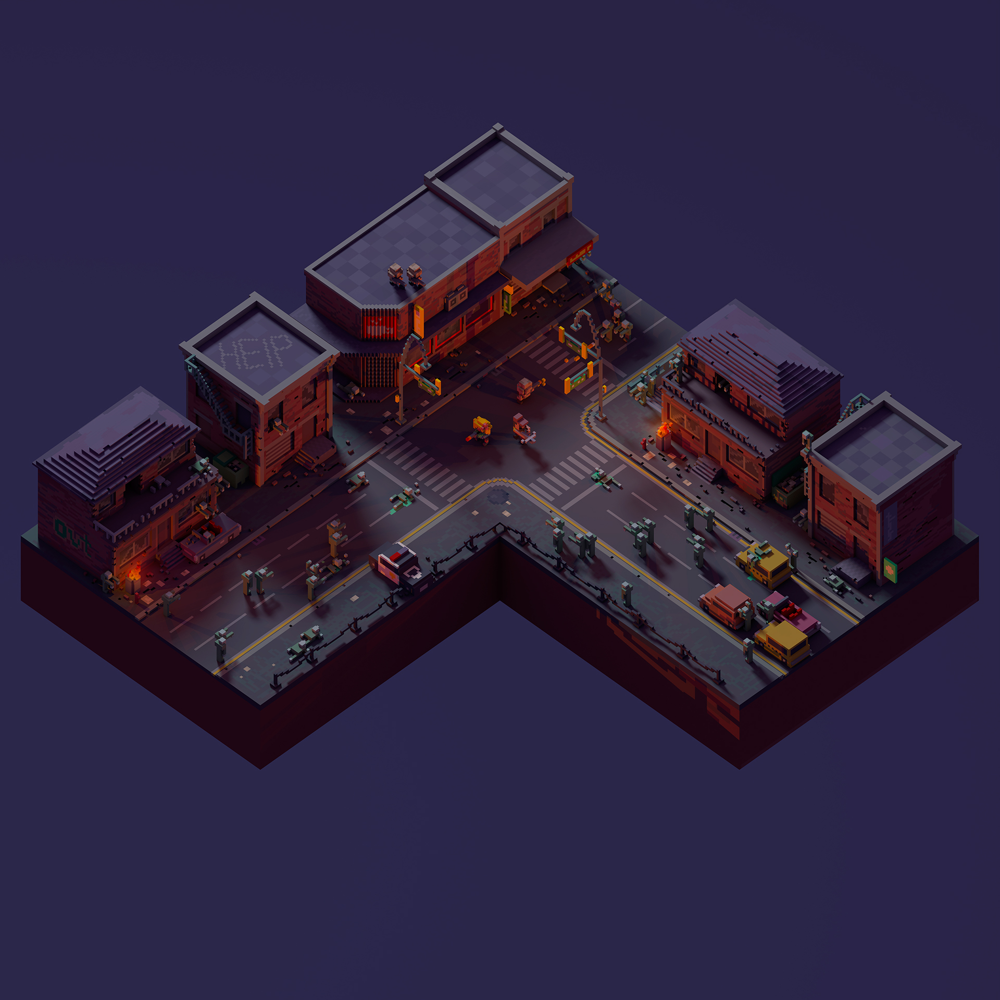

# 美术资源汇总

## 免费素材

- [Kenny Asset](https://www.kenney.nl/assets/category:3D?sort=update)
- [KayKit - Character Pack : Adventurers](https://kaylousberg.itch.io/kaykit-adventurers)
- [Voxel space colony](https://maxparata.itch.io/voxelspacecolony)
- [Isometric Zombie Apocalypse](https://maxparata.itch.io/isometriczombieapocalypse-monogon)

## 美术风格参考

- 
- 

目前暂定风格：体素风格 + 移轴摄影。表现出类似方块小玩具的效果。
效果参考：[Noodlor MC 雕塑](https://www.pinterest.com/mcnoodlor/2017-statue-collection/)

## 软件工具

- 体素建模：[MagicaVoxel](https://ephtracy.github.io/)
- 体素化（可以输入普通3D模型，获得体素化的模型）：[Online Voxelizer](https://drububu.com/miscellaneous/voxelizer/?out=obj)

## AI生成3D模型

- [Genie, Luma AI](https://lumalabs.ai/genie?view=create)
- [Meshy](https://app.meshy.ai/discover)
- [SudoAI](https://www.sudo.ai/)
- [Tripo AI](https://www.tripo3d.ai/app)
- [CSM](https://3d.csm.ai/)
